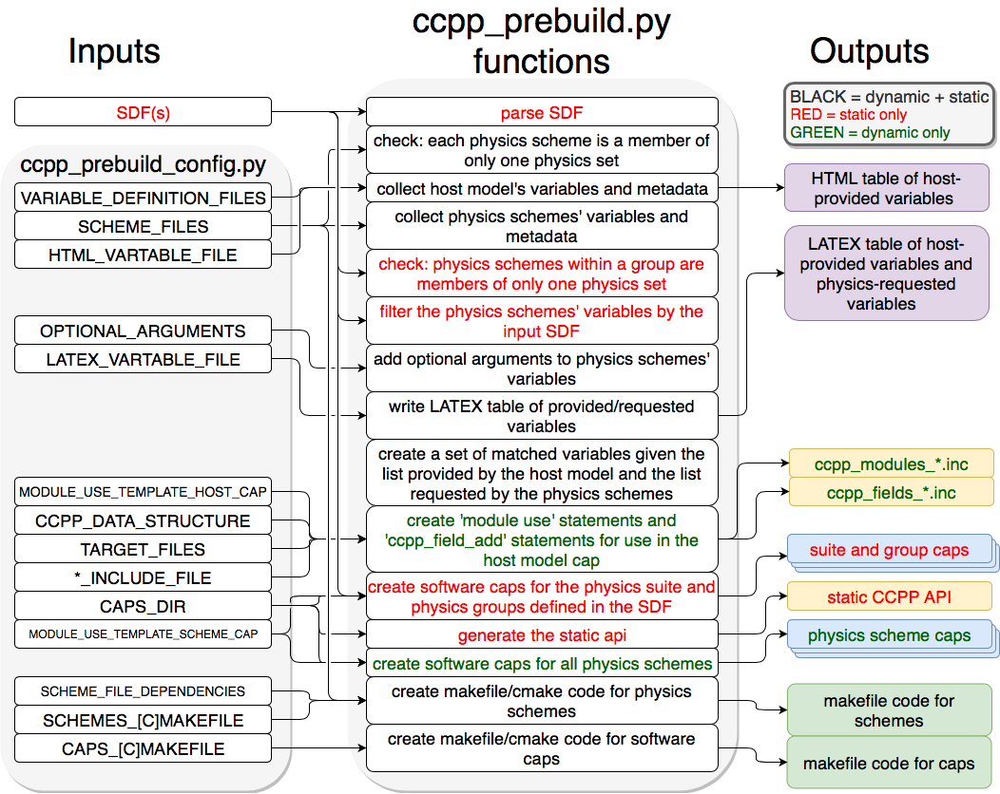

..  _CCPPPreBuild:

**************************************************
Technical Aspects of the CCPP *Prebuild*
**************************************************

=============================
*Prebuild* Script Function  
=============================

The :term:`CCPP` *prebuild* script **ccpp/framework/scripts/ccpp_prebuild.py** is the central piece of code that connects the host model with the :term:`CCPP-Physics` schemes (see Figs. 3.2 and 3.3). This script must be run before compiling the :term:`CCPP-Physics` library and the host model cap. This may be done manually or as part of a host model build-time script. In the case of the SCM, **ccpp_prebuild.py** must be run manually, as it not incorporated in that model’s build system. In the case of NEMSfv3gfs, **ccpp_prebuild.py** can be run manually or automatically as a step in the build system.

The :term:`CCPP` *prebuild* script automates several tasks based on the information collected from the metadata tables on the host model side and from the individual physics schemes (see :numref:`Figure %s <ccpp_prebuild>`):
 * Compiles a list of variables required to run all schemes in the :term:`CCPP-Physics` pool.
 * Compiles a list of variables provided by the host model.
 * Matches these variables by their **standard_name**, checks for missing variables and mismatches of their attributes (e.g., units, rank, type, kind) and processes information on optional variables.
 * For the static build only, filters out unused variables for a given suite.
 * For the dynamic build only, creates Fortran code (**ccpp_modules_*.inc**, **ccpp_fields_*.inc**) that stores pointers to the host model variables in the **cdata** structure.
 * Autogenerates software caps as appropriate, depending on the build type.
    * If dynamic, the script generates individual caps for all physics schemes.
    * If static, the script generates caps for the suite as a whole and physics groups as defined in the input :term:`SDF`\s; in addition, the :term:`CCPP` API for the static build is generated.
 * Populates makefiles with schemes, scheme dependencies, and caps. For the static build, statements to compile the static :term:`CCPP` API are included as well. 

.. _ccpp_prebuild:

   : *Schematic of tasks automated by the* **ccpp_prebuild.py** *script and associated inputs and outputs. Red text denotes entries that are valid for the static build only, green text entries that are valid for the dynamic build only, and black text denotes entries valid for both the dynamic and static builds. The majority of the input is controlled through the host-model dependent* **ccpp_prebuild_config.py** *, whose user-editable variables are included as all-caps within the* **ccpp_prebuild_config.py** *bubble. Outputs are color-coded according to their utility: purple outputs are informational only (useful for developers, but not necessary to run the code), yellow outputs are used within the host model, blue outputs are connected to the physics, and green outputs are used in the model build.*

=============================
Script Configuration
=============================

To connect the :term:`CCPP` with a host model **XYZ**, a Python-based configuration file for this model must be created in the host model’s repository. The easiest way is to copy an existing configuration file for the TEST model in sub-directory **schemes/check** of the ccpp-Framework repository. The configuration in **ccpp_prebuild_config.py** depends largely on (a) the directory structure of the host model itself, (b) where the **ccpp-framework** and the **ccpp-physics** directories are located relative to the directory structure of the host model, and (c) from which directory the **ccpp_prebuild.py** script is executed before/during the build process (this is referred to as basedir in **ccpp_prebuild_config_XYZ.py**).

Listing 8.1 contains an example for the CCPP-SCM prebuild config. Here, it is assumed that both **ccpp-framework** and **ccpp-physics** are located in directories ccpp/framework and ccpp/physics of the top-level directory of the host model, and that **ccpp_prebuild.py** is executed from the same top-level directory.

Listing 8.1: :term:`CCPP` prebuild config for SCM (shortened)

 | **# Host model identifier**
 | **HOST_MODEL_IDENTIFIER = "TEST"**
 | **# Add all files with metadata tables on the host model side,**
 | **# relative to basedir = top-level directory of host model**
 | **VARIABLE_DEFINITION_FILES = [**
 |     **’scm/src/gmtb_scm_type_defs.f90’,**
 |     **’scm/src/gmtb_scm_physical_constants.f90’**
 |     **]**
 | **# Add all physics scheme dependencies relative to basedir - note that the CCPP**
 | **# rules stipulate that dependencies are not shared between the schemes!**
 | **SCHEME_FILES_DEPENDENCIES = [] # can be empty**
 | **# Add all physics scheme files relative to basedir**
 | **SCHEME_FILES = {**
 | **# Relative path : [ list of sets in which scheme may be called ]**
 | **’ccpp/physics/physics/GFS_DCNV_generic.f90’ : [’physics’],**
 | **’ccpp/physics/physics/sfc_sice.f’ : [’physics’],**
 | **}**
 | **# Auto-generated makefile/cmakefile snippets that contains all schemes**
 | **SCHEMES_MAKEFILE = ’ccpp/physics/CCPP_SCHEMES.mk’**
 | **SCHEMES_CMAKEFILE = ’ccpp/physics/CCPP_SCHEMES.cmake’**
 | **# CCPP host cap in which to insert the ccpp_field_add statements;**
 | **# determines the directory to place ccpp_{modules,fields}.inc**
 | **TARGET_FILES = [’scm/src/gmtb_scm.f90’, ]**
 | **# Auto-generated makefile/cmakefile snippets that contains all caps**
 | **CAPS_MAKEFILE = ’ccpp/physics/CCPP_CAPS.mk’**
 | **CAPS_CMAKEFILE = ’ccpp/physics/CCPP_CAPS.cmake’**
 | **# Directory where to put all auto-generated physics caps**
 | **CAPS_DIR = ’ccpp/physics/physics’**
 | **# Directory where the suite definition files are stored**
 | **SUITES_DIR = 'ccpp/suites'**
 | 
 | **# Optional arguments - only required for schemes that use optional arguments.**
 | **# ccpp_prebuild.py will throw an exception if it encounters a scheme subroutine with optional arguments if no entry is made here. Possible values are:**
 | **OPTIONAL_ARGUMENTS = {**
 | **#’subroutine_name_1’ : ’all’, #’subroutine_name_2’ : ’none’, #’subroutine_name_3’ : [ ’var1’, ’var2’],}**
 | **# Names of Fortran include files in the host model cap (do not change);**
 | **# both files will be written to the directory of each target file**
 | **MODULE_INCLUDE_FILE = 'ccpp_modules.inc'**
 | **FIELDS_INCLUDE_FILE = 'ccpp_fields.inc'**
 | **# Directory where to write static API to**
 | **STATIC_API_DIR = 'scm/src'**
 | 
 | **# HTML document containing the model-defined CCPP variables**
 | **HTML_VARTABLE_FILE = ’ccpp/physics/CCPP_VARIABLES.html’**
 | **# LaTeX document containing the provided vs requested CCPP variables**
 | **LATEX_VARTABLE_FILE = ’ccpp/framework/doc/DevelopersGuide/CCPP_VARIABLES.tex’**
 | **######## Template code to generate include files ########**
 | **# Name of the CCPP data structure in the host model cap;**
 | **# in the case of SCM, this is a vector with loop index i**
 | **CCPP_DATA_STRUCTURE = ’cdata(i)’**
 | **# EOF**
 | 

Although most of the variables in the **ccpp_prebuild_config.py** script are described by in-line comments in the code listing above and their use is described in :numref:`Figure %s <ccpp_prebuild>`, some clarifying comments are in order regarding the **SCHEME_FILES** variable. This is a list of CCPP-compliant physics scheme entry/exit point source files. For each item in this list, a list of physics “sets” in which the scheme may be executed is included. A physics set refers to a collection of physics schemes that are able to be called together and executed in one software domain of a host model that do not share variables with schemes from another physics set. This feature was included to cater to the needs of the FV3GFS, which provides a clear-cut example of this concept. In this model, part of the microphysics scheme needed to be coupled more tightly with the dynamics, so this part of the microphysics code was put into a physics set labeled “fast_physics” which is executed within the dycore code. The variables in this physics set are distinct (in memory, due to a lack of a model variable registry) from variables used in the rest of the physics, which are part of the “slow_physics” set. In the future, it may be necessary to have additional sets, e.g. for chemistry or separate surface model components that do not share data/memory with other model components. For simpler models such as the GMTB SCM, only one physics set (labeled “physics”) is necessary. The concept of physics sets is different from physics “groups”, which are capable of sharing variables among their members and between groups but are used to organize schemes into sequential, callable units.

=============================
Running ccpp_prebuild.py 
=============================

Once the configuration in **ccpp_prebuild_config.py** is complete, the **ccpp_prebuild.py** script can be run from the top level directory. For the SCM, this script must be run (in dynamic build mode only) to reconcile data provided by the SCM with data required by the physics schemes before compilation and to generate physics caps and makefile segments. For the :term:`UFS` Atmosphere host model, the **ccpp_prebuild.py** script is called automatically by the NEMSfv3gfs build system when the :term:`CCPP` build is requested (by running the :term:`CCPP` regression tests or by passing the option CCPP=Y and others to the **compile.sh** script; see the compile commands defined in the :term:`CCPP` regression test configurations for further details). 

For developers adding a CCPP-compliant physics scheme, running **ccpp_prebuild.py** periodically is recommended to check that the metadata in the argument tables match between the host model and the physics scheme. For the :term:`UFS` Atmosphere, running **ccpp_prebuild.py** manually is identical to running it for the SCM (since the relative paths to their respective **ccpp_prebuild_config.py** files are identical), except it may be necessary to add the **--static** and **--suites** command-line arguments for the static option.

As alluded to above, the **ccpp_prebuild.py** script has six command line options, with the path to a host-model specific configuration file (**--config**) being the only necessary input option:

 |  **-h, --help**          show this help message and exit
 |  **--config**     **PATH_TO_CONFIG/config_file**      path to CCPP *prebuild* configuration file
 |  **--clean**          remove files created by this script, then exit
 |  **--debug**          enable debugging output
 |  **--static**             enable a static build for a given suite definition file
 |  **--suites** SUITES    SDF(s) to use (comma-separated,for static build only, without path)
 
So, the simplest possible invocation of the script (called from the host model’s top level directory) would be:

**./ccpp/framework/scripts/ccpp_prebuild.py** \ 
**--config ./ccpp/config/ccpp_prebuild_config.py [--debug]**
 
which assumes a dynamic build with a configuration script located at the specified path. The debug option can be used for more verbose output from the script.

For a static build (described above), where the :term:`CCPP-Framework` and the physics libraries are statically linked to the executable and a set of one or more suites are defined at build-time, the **--suites** and **--static** options must be included. The :term:`SDF`\(s) should be specified using the **--suites** command-line argument. Such files are included with the SCM and NEMSfv3gfs repositories, and must be included with the code of any host model to use the :term:`CCPP`\. Unless the **--static** command-line argument is used with the script, it will assume dynamically linked libraries.   An example of a static build using two :term:`SDF`\s is:

**./ccpp/framework/scripts/ccpp_prebuild.py** \ 
**--config=./ccpp/config/ccpp_prebuild_config.py --static** \ 
**--suites=FV3_GFS_v15,FV3_CPT_v0**

If the :term:`CCPP` *prebuild* step is successful, the last output line will be:

**INFO: CCPP prebuild step completed successfully.**
 
To remove all files created by **ccpp_prebuild.py**, for example as part of a host model’s **make clean** functionality, execute the same command as before, but with **--clean** appended:
 
**./ccpp/framework/scripts/ccpp_prebuild.py** \ 
**--config=./ccpp/config/ccpp_prebuild_config.py --static** \ 
**--suites=FV3_GFS_v15,FV3_CPT_v0** \
--clean

=============================
Troubleshooting
=============================

If invoking the **ccpp_prebuild.py** script fails, some message other than the success message will be written to the terminal output. Specifically, the terminal output will include informational logging messages generated from the script, any error messages written to the python logging utility, and a Python traceback that pinpoints the line within the script where the error caused failure. Some common errors (minus the typical logging output and traceback output) and solutions are described below, with non-bold font used to denote aspects of the message that will differ depending on the problem encountered. This is not an exhaustive list of possible errors, however. For example, in this version of the code, there is no cross-checking that the information provided in the metadata tables corresponds to the actual Fortran code, so even though **ccpp_prebuild.py** may complete successfully, there may be related compilation errors later in the build process. For further help with an undescribed error, please contact gmtb-help@ucar.edu. 

 #. **ERROR: Configuration file** erroneous/path/to/config/file **not found**
      * Check that the path entered for the **--config** command line option points to a readable configuration file.
 #. **KeyError**: 'erroneous_scheme_name' when using the **--static** and **--suites** options
      * This error indicates that a scheme within the supplied :term:`SDF`\s does not match any scheme names found in the SCHEME_FILES variable of the supplied configuration file that lists scheme source files. Double check that the scheme’s source file is included in the SCHEME_FILES list and that the scheme name that causes the error is spelled correctly in the supplied :term:`SDF`\s and matches what is in the source file (minus any *_init, *_run, *_finalize suffixes).
 #. **CRITICAL: Suite definition file** erroneous/path/to/SDF.xml **not found**. 

    **Exception: Parsing suite definition file** erroneous/path/to/SDF.xml **failed**.
      * Check that the path **SUITES_DIR** in the :term:`CCPP` prebuild config and the names entered for the **--suites** command line option are correct.
 #. **ERROR: Scheme file** path/to/offending/scheme/source/file **belongs to multiple physics sets**: set1, set2

    **Exception: Call to check_unique_pset_per_scheme failed**.
      * This error indicates that a scheme defined in the **SCHEME_FILES** variable of the supplied configuration file belongs to more than one set. Currently, a scheme can only belong to one physics set.
 #. **ERROR: Group** group1 **contains schemes that belong to multiple physics sets**: set1,set2

    **Exception: Call to check_unique_pset_per_group failed**.
      * This error indicates that one of the groups defined in the supplied :term:`SDF`\(s) contains schemes that belong to more than one physics set. Make sure that the group is defined correctly in the :term:`SDF`\(s) and that the schemes within the group belong to the same physics set (only one set per scheme is allowed at this time).
 #. **INFO: Parsing metadata tables for variables provided by host model** …

    **IOError: [Errno 2] No such file or directory**: 'erroneous_file.f90'
      * Check that the paths specified in the **VARIABLE_DEFINITION_FILES** of the supplied configuration file are valid and contain CCPP-compliant host model variable metadata tables.
 #. **Exception: Encountered invalid line** "some fortran" **in argument table** variable_metadata_table_name
      * This is likely the result of not ending a variable metadata table with a line containing only ‘!!’. Check that the formatting of the offending variable metadata table is correct.
 #. **Exception: Error parsing variable entry** "erroneous variable metadata table entry data" **in argument table** variable_metadata_table_name
      * Check that the formatting of the metadata entry described in the error message is OK. The number of metadata columns must match the table header and each entry’s columns must be separated by a ‘|’ character (be sure that the ‘!’ character was not used accidentally).
 #. **Exception: New entry for variable** var_name **in argument table** variable_metadata_table_name **is incompatible with existing entry**:
     | **Existing: Contents of <mkcap.Var object at 0x10299a290> (* = mandatory for compatibility)**:
     |  **standard_name** = var_name *
     |  **long_name**     =
     |  **units**         = various *
     |  **local_name**    = 
     |  **type**          = real *
     |  **rank**          = (:,:,:) *
     |  **kind**          = kind_phys *
     |  **intent**        = none
     |  **optional**      = F
     |  **target**        = None
     |  **container**     = MODULE_X TYPE_Y
     | **vs. new: Contents of <mkcap.Var object at 0x10299a310> (* = mandatory for compatibility)**:
     |  **standard_name** = var_name *
     |  **long_name**     = 
     |  **units**         = frac *
     |  **local_name**    = 
     |  **type**          = real *
     |  **rank**          = (:,:) *
     |  **kind**          = kind_phys *
     |  **intent**        = none
     |  **optional**      = F
     |  **target**        = None
     |  **container**     = MODULE_X TYPE_Y

     * This error is associated with a variable that is defined more than once (with the same standard name) on the host model side. Information on the offending variables is provided so that one can provide different standard names to the different variables.
 #. **Exception: Scheme name differs from module name**: **module_name**\= "X" vs. **scheme_name**\= "Y"
      * Make sure that each scheme in the errored module begins with the module name and ends in either *_init, *_run, or *_finalize.
 #. **Exception: Encountered closing statement "end" without descriptor (subroutine, module, ...): line X= "end " in file** erroneous_file.F90
      * This script expects that subroutines and modules end with descriptor and name, e.g. ‘end subroutine subroutine_name’.
 #. **Exception: New entry for variable** var_name **in argument table of subroutine** scheme_subroutine_name **is incompatible with existing entry**:
     | **existing: Contents of <mkcap.Var object at 0x10299a290> (* = mandatory for compatibility)**:
     |  **standard_name** = var_name *
     |  **long_name**     =
     |  **units**         = various *
     |  **local_name**    = 
     |  **type**          = real *
     |  **rank**          = (:,:,:) *
     |  **kind**          = kind_phys *
     |  **intent**        = none
     |  **optional**      = F
     |  **target**        = None
     |  **container**     = MODULE_X TYPE_Y
     | **vs. new: Contents of <mkcap.Var object at 0x10299a310> (* = mandatory for compatibility)**:
     |  **standard_name** = var_name *
     |  **long_name**     = 
     |  **units**         = frac *
     |  **local_name**    = 
     |  **type**          = real *
     |  **rank**          = (:,:) *
     |  **kind**          = kind_phys *
     |  **intent**        = none
     |  **optional**      = F
     |  **target**        = None
     |  **container**     = MODULE_X TYPE_Y

     * This error is associated with physics scheme variable metadata entries that have the same standard name with different mandatory properties (either units, type, rank, or kind currently -- those attributes denoted with a *). This error is distinguished from the error described in 9 above, because the error message mentions “in argument table of subroutine” instead of just “in argument table”.
 #. **ERROR: Check that all subroutines in module** module_name **have the same root name**:
     **i.e. scheme_A_init, scheme_A_run, scheme_A_finalize**
     **Here is a list of the subroutine names for scheme** scheme_name:
       scheme_name_finalize, scheme_name_run
     * All schemes must have *_init, *_run, *_finalize subroutines contained within its entry/exit point module.
 #. **ERROR: Variable** X **requested by MODULE_**\Y **SCHEME_**\Z **SUBROUTINE_**\A **not provided by the model**
     **Exception: Call to compare_metadata failed.**

     * A variable requested by one or more physics schemes is not being provided by the host model. If the variable exists in the host model but is not being made available for the :term:`CCPP`, an entry must be added to one of the host model variable metadata tables.
 #. **ERROR:   error, variable** X **requested by MODULE_**\Y **SCHEME_**\Z **SUBROUTINE_**\A **cannot be identified unambiguously. Multiple definitions in MODULE_**\Y **TYPE_**\B
      * A variable is defined in the host model variable metadata tables more than once (with the same standard name). Remove the offending entry or provide a different standard name for one of the duplicates.
 #. **ERROR:   incompatible entries in metadata for variable** var_name:
     | **provided:  Contents of <mkcap.Var object at 0x104883210> (* = mandatory for compatibility)**:
     |  **standard_name** = var_name *
     |  **long_name**     = 
     |  **units**         = K *
     |  **local_name**    = 
     |  **type**          = real *
     |  **rank**          =  *
     |  **kind**          = kind_phys *
     |  **intent**        = none
     |  **optional**      = F
     |  **target**        = None
     |  **container**     = 
     | **requested: Contents of <mkcap.Var object at 0x10488ca90> (* = mandatory for compatibility)**:
     |  **standard_name** = var_name *
     |  **long_name**     = 
     |  **units**         = none *
     |  **local_name**    = 
     |  **type**          = real *
     |  **rank**          =  *
     |  **kind**          = kind_phys *
     |  **intent**        = in
     |  **optional**      = F
     |  **target**        = None
     |  **container**     = 
 #. **Exception: Call to compare_metadata failed**.
      * This error indicates a mismatch between the attributes of a variable provided by the host model and what is requested by the physics. Specifically, the units, type, rank, or kind don’t match for a given variable standard name. Double-check that the attributes for the provided and requested mismatched variable are accurate. If after checking the attributes are indeed mismatched, reconcile as appropriate (by adopting the correct variable attributes either on the host or physics side).

Note: One error that the **ccpp_prebuild.py** script will not catch is if a physics scheme lists a variable in its actual (Fortran) argument list without a corresponding entry in the subroutine’s variable metadata table. This will lead to a compilation error when the autogenerated scheme cap is compiled:

**Error: Missing actual argument for argument 'X' at (1)**
