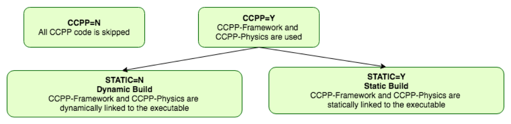
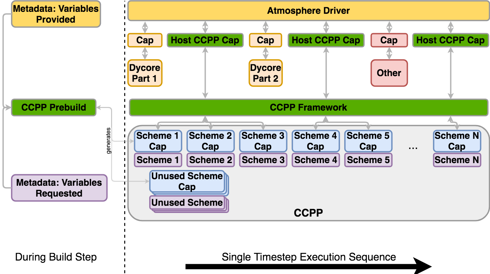
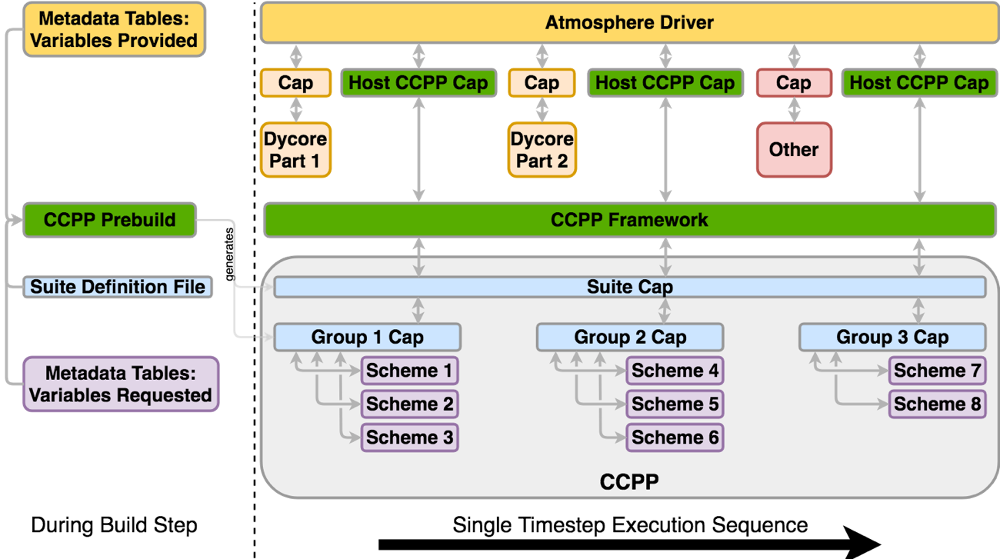

.. _ConfigBuildOptions:
  
*****************************************
CCPP Configuration and Build Options
*****************************************
While the *CCPP-Framework* code can be compiled independently, the *CCPP-Physics* code can only be used within a host modeling system that provides the variables and the kind, type, and DDT definitions. As such, it is advisable to integrate the CCPP configuration and build process with the host model’s. Part of the build process, known as the *prebuild* step since it precedes compilation, involves running a Python script that performs multiple functions. These functions include configuring the *CCPP-Physics* for use with the host model and autogenerating FORTRAN code to communicate variables between the physics and the dynamical core. The *prebuild* step will be discussed in detail in Chapter 8.

There are some differences between building and running the SCM and the UFS Atmosphere. In the case of the UFS Atmosphere as the host model, there are several build options (:numref:`Figure %s <ccpp_build_option>`). The choice can be specified through command-line options supplied to the ``compile.sh`` script for manual compilation or through a regression test (RT) configuration file. Detailed instructions for building the code are discussed in Chapter 9.

The relevant options for building CCPP with the UFS Atmosphere can be described as follows:

* **Without CCPP (non-CCPP)**: The code is compiled without CCPP and runs using the original UFS Atmosphere physics drivers, such as ``GFS_physics_driver.F90``. This option entirely bypasses all CCPP functionality and is only used for regression testing against the unmodified UFS Atmosphere codebase.

* **Hybrid CCPP**: The code is compiled with CCPP enabled and allows combining non-CCPP-Physics and CCPP-compliant physics. This is restricted to parameterizations that are termed as “physics” by EMC, i.e. that in a non-CCPP build would be called from ``GFS_physics_driver.F90``. Parameterizations that fall into the categories “time_vary”, “radiation” and “stochastics” have to be CCPP-compliant. The hybrid option is fairly complex and not recommended for users to start with. It is intended as a temporary measure for research and development until all necessary physics are available through the CCPP. This option uses the existing physics calling infrastructure ``GFS_physics_driver.F90`` to call either CCPP-compliant or non-CCPP-compliant schemes within the same run. Note that the *CCPP-Framework* and *CCPP-physics* are dynamically linked to the executable for this option.

* **Standalone CCPP (non-Hybrid)**: The code is compiled with CCPP enabled and restricted to CCPP-compliant physics. That is, any parameterization to be called as part of a suite must be available in CCPP. Physics scheme selection and order is determined at runtime by an external suite definition file (SDF; see Chapter 4.1 for further details on the SDF). The existing physics-calling code ``GFS_physics_driver.F90`` and ``GFS_radiation_driver.F90`` are bypassed altogether in this mode and any additional code needed to connect parameterizations within a suite previously contained therein is executed from the so-called CCPP-compliant “interstitial schemes”. One further option determines how the CCPP-compliant physics are called within the host model:
    * **Dynamic CCPP**: This option is recommended for research and development users, since it allows choosing any physics schemes within the CCPP library at runtime by making adjustments to the CCPP SDF and the model namelist. This option carries computational overhead associated with the higher level of flexibility. Note that the *CCPP-Framework* and *CCPP-physics* are dynamically linked to the executable.
    * **Static CCPP**: The code is compiled with CCPP enabled but restricted to CCPP-compliant physics defined by one or more SDFs used at compile time. This option is recommended for users interested in production-mode and operational applications, since it limits flexibility in favor of runtime performance and memory footprint. Note that the *CCPP-Framework* and *CCPP-physics* are statically linked to the executable.

.. _ccpp_build_option:

    *Options for building the CCPP with the UFS Atmosphere. The most common options will be to use the CCPP in standalone mode (CCPP=Y HYBRID=N). Runs where computational performance is valued over physics flexibility should use STATIC=Y.*

Conversely, for the SCM, only the dynamic CCPP standalone build is supported.

For all options that activate the CCPP, the ``ccpp_prebuild.py`` Python script must be run. This may be done manually or as part of a host model build-time script. In the case of the SCM,         ``ccpp_prebuild.py`` must be run manually, as it is not incorporated in that model’s build system. In the case of the UFS Atmosphere, ``ccpp_prebuild.py`` is run automatically as a step in the build system, although it can be run manually for debugging purposes.

The path to a host-model specific configuration file is the only required argument to   ``ccpp_prebuild.py``. Such files are included with the SCM and NEMSfv3gfs repositories, and must be included with the code of any host model to use the CCPP. :numref:`Figure %s <ccpp_dynamic_build>` depicts the main functions of the ``ccpp_prebuild.py`` script for the dynamic build. Using information included in the configuration file, the script reads metadata associated with all physics variables provided by the host model and metadata associated with all physics variables requested by all physics schemes in the CCPP (at least those whose entry/exit point source files are listed in the configuration file). The script matches the variables and autogenerates software caps for each physics scheme entry point so that they are available to be called by the host model, depending on the contents of a SDF provided at runtime.

.. _ccpp_dynamic_build:

    *This figure depicts one generalized example of the interaction between an atmospheric model and CCPP-Physics for one timestep using the* **dynamic** *build, with execution progressing toward the right. The “Atmosphere Driver” box represents model superstructure code, perhaps responsible for I/O, time-stepping, and other model component interactions. In this example, physics code must be executed between portions of the dycore code and another model component. The CCPP host cap allows multiple calls to groups of physics schemes defined in a SDF. The CCPP-Framework executes each physics group consisting of a collection of schemes and their associated software caps. The left side of the figure depicts the function of the ``ccpp_prebuild.py`` *script, matching variables from the host model with CCPP-compliant* schemes and autogenerating software caps for each scheme (regardless of its use within a particular suite).*

In case of a static build, the basic function of the script is the same, but the output (namely, autogenerated software caps) take a different, more computationally-efficient approach. For a general idea of how the static option is different, compare :numref:`Figure %s <ccpp_static_build>` for the static case with :numref:`Figure %s <ccpp_dynamic_build>` for the dynamic case. As mentioned, during the build step, one or more SDFs are used as an additional input. The script parses the SDF(s) and only matches provided/requested variables that are used within the particular physics suite(s). Rather than autogenerate software caps for each physics scheme (regardless of request), in static mode, the script autogenerates software caps for the physics suite(s) as a whole and for each physics group as defined in the SDF(s). At runtime, a single SDF is used to select the suite that will be executed in the run. This arrangement allows for more efficient variable recall (which is done once for all physics schemes within each group of a suite), leads to a reduced memory footprint of the CCPP compared to the dynamic option and speeds up execution to be on par with physics called using the existing physics-calling code.

.. _ccpp_static_build:

    *As in* :numref:`Figure %s <ccpp_dynamic_build>` *, but for the* **static** *build using a single SDF. In this case, software caps are autogenerated for the suite and physics groups (defined in the SDF provided to the* ``ccpp_prebuild.py`` *script) rather than for individual schemes. The suite must be defined via the SDF at prebuild time. When multiple SDFs are provided during the build step, multiple suite caps and associated group caps are produced, but only one is used at runtime.*
