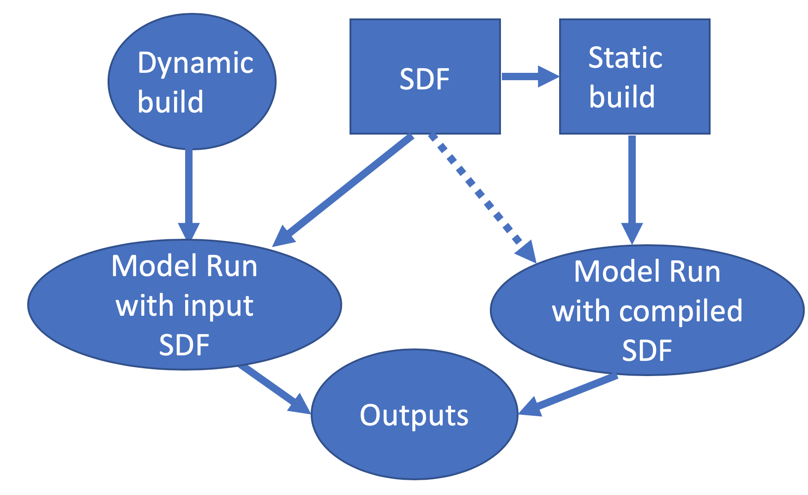

..  _ConstructingSuite:

*******************************
Constructing Suites
*******************************

==============================
Suite Definition File
==============================

The :term:`SDF` is a file in XML format used to specify the name of the suite, the physics schemes to run, groups of physics that run together, the order in which to run the physics, and whether subcycling will be used to run any of the parameterizations with shorter timesteps. The :term:`SDF` files are located in ``ccpp/suites/suite_*.xml``. 

In addition to the primary parameterization categories (such as radiation, boundary layer, deep convection, resolved moist physics, etc.), the :term:`SDF` can have an arbitrary number of interstitial schemes in between the parameterizations to preprocess or postprocess data. In many models, this interstitial code is not obvious to the model user but, with the :term:`SDF`, both the primary parameterizations and the interstitial schemes are listed explicitly.

The name of the suite is listed at the top of the :term:`SDF` and must be consistent with the name of the :term:`SDF`: file ``suite_ABC.xml`` contains ``suite name=’ABC’``, as in the example below. The suite name is followed by the ``time_vary`` step, which is run only once when the model is first initialized.

.. code-block:: xml
 
   <suite name="ABC" lib="ccppphys" ver="3.0.0">
     <!-- <init></init> -->
     <group name="time_vary">
       <subcycle loop="1">
         <scheme>GFS_time_vary_pre</scheme>
         <scheme>GFS_rrtmg_setup</scheme>
         <scheme>GFS_rad_time_vary</scheme>
         <scheme>GFS_phys_time_vary</scheme>
       </subcycle>
     </group>

--------------
Groups
--------------

The concept of grouping physics in the :term:`SDF` (reflected in the ``<group name="XYZ">`` elements) enables “groups” of parameterizations to be called with other computation (such as related to the dycore, I/O, etc.) in between. One can edit the groups to suit the needs of the host application. For example, if a subset of physics schemes needs to be more tightly connected with the dynamics and called more frequently, one could create a group consisting of that subset and place a ``ccpp_run`` call in the appropriate place in the host application. The remainder of the parameterization groups could be called using ``ccpp_run`` calls in a different part of the host application code.

-----------------
Subcycling 
-----------------
The :term:`SDF` allows subcycling of schemes, or calling a subset of schemes at a smaller time step than others. The ``<subcycle loop = n>`` element in the :term:`SDF` controls this function. All schemes within such an element are called n times during one ccpp_run call. An example of this is found in the ``FV3_GFS_v15.xml`` :term:`SDF`, where the surface schemes are executed twice for each timestep (implementing a predictor/corrector paradigm):

.. code-block:: xml
 
    <!-- Surface iteration loop -->
    <subcycle loop="2">
      <scheme>sfc_diff</scheme>
      <scheme>GFS_surface_loop_control_part1</scheme>
      <scheme>sfc_nst_pre</scheme>
      <scheme>sfc_nst</scheme>
      <scheme>sfc_nst_post</scheme>
      <scheme>lsm_noah</scheme>
      <scheme>sfc_sice</scheme>
      <scheme>GFS_surface_loop_control_part2</scheme>
    </subcycle>

Note that currently no time step information is included in the :term:`SDF` and that the subcycling of schemes resembles more an iteration over schemes with the loop counter being available as integer variable with standard name ccpp_loop_counter. If subcycling is used for a set of parameterizations, the smaller time step must be an input argument for those schemes.

----------------------
Order of Schemes
----------------------

Schemes may be interdependent and the order in which the schemes are run may make a difference in the model output. For the static build, reading the :term:`SDF`\(s) and defining the order of schemes for each suite happens at compile time. For the dynamic build, no :term:`SDF` is used at compile time (:numref:`Figure %s <ccpp_sdf_dynamic_static>`). Instead, at runtime the :term:`SDF` is read and the order of schemes is determined. 

Some schemes require additional interstitial code that must be run before or after the scheme and cannot be part of the scheme itself. This can be due to dependencies on other schemes and/or the order of the schemes as determined in the :term:`SDF`.

.. _ccpp_sdf_dynamic_static:

   *Schematic of the use of the SDF in dynamic and static builds. Note that, for the static build, more than one SDF can be supplied at compile time, but only one can be used at runtime*.

=========================
Interstitial Schemes
=========================
The :term:`SDF` can have an arbitrary number of additional interstitial schemes in between the primary parameterizations to preprocess or postprocess data. There are two main types of interstitial schemes, scheme-specific and suite-level. The scheme-specific interstitial scheme is needed for one specific scheme and the suite-leve interstitial scheme processes data that are relevant for various schemes within a suite.

=========================
SDF Examples
=========================

----------------------------------------------------
Simplest Case: Single Group and no Subcycling
----------------------------------------------------

Consider the simplest case, in which all physics schemes are to be called together in a single group with no subcycling (i.e. ``subcycle loop=”1”``).  The subcycle loop must be set in each group.  The :term:`SDF` ``suite_Suite_A.xml`` could contain the following:

.. code-block:: console
 
   <?xml version="1.0" encoding="UTF-8"?>
   <suite name="Suite_A" lib="ccppphys" ver="3.0.0">
     ...
     <group name="physics">
       <subcycle loop="1">
         <scheme>Suite_A_interstitial_1</scheme>
         <scheme>scheme_1_pre</scheme>
         <scheme>scheme_1</scheme>
         <scheme>scheme_1_post</scheme>
         <scheme>scheme_2_generic_pre</scheme>
         <scheme>scheme_2</scheme>
         <scheme>scheme_2_generic_post</scheme>
         <scheme>Suite_A_interstitial_2</scheme>
         <scheme>scheme_3</scheme>
         ...
         <scheme_n</scheme>
       </subcycle>
     </group>
   </suite>
 
 
Note the syntax of the :term:`SDF` file. The root (the first element to appear in the xml file) is the ``suite`` with the ``name`` of the suite given as an attribute. In this example, the suite name is ``Suite_A``. Within each suite are groups, which specify a physics group to call (i.e. ``physics, fast_physics, time_vary, radiation, stochastics``). Each group has an option to subcycle. The value given for loop determines the number of times all of the schemes within the ``subcycle`` element are called. Finally, the ``scheme`` elements are children of the ``subcycle`` elements and are listed in the order they will be executed. In this example, ``scheme_1_pre`` and ``scheme_1_post`` are scheme-specific preprocessing and postprocessing interstitial schemes, respectively. The suite-level preprocessing and postprocessing interstitial ``schemes scheme_2_generic_pre`` and ``scheme_2_generic_post`` are also called in this example. ``Suite_A_interstitial_2`` is a scheme for ``suite_A`` and connects various schemes within this suite.

-------------------------------
Case with Multiple Groups
-------------------------------

Some models require that the physics be called in groups, with non-physics computations in-between the groups.

.. code-block:: xml
 
   <?xml version="1.0" encoding="UTF-8"?>
   <suite name="Suite_B" lib="ccppphys" ver="3.0.0">
     <group name="g1">
       <subcycle loop="1">
         <scheme>SchemeX</scheme>
         <scheme>SchemeY</scheme>
         <scheme>SchemeZ</scheme>
     </subcycle>
     </group>
     <group name="g2">
       <subcycle loop="1">
         <scheme>SchemeA</scheme>
         <scheme>SchemeB</scheme>
         <scheme>SchemeC</scheme>
       </subcycle>
     </group>
   </suite>

---------------------------- 
Case with Subcycling
----------------------------

Consider the case where a model requires that some subset of physics be called on a smaller time step than the rest of the physics, e.g. for computational stability. In this case, one would make use of the subcycle element as follows: 

.. code-block:: xml
 
   <?xml version="1.0" encoding="UTF-8"?>
   <suite name="Suite_C" lib="ccppphys" ver="3.0.0">
     <group name="g1">
       <subcycle loop="1">
         <scheme>scheme_1</scheme>
         <scheme>scheme_2</scheme>
       </subcycle>
       <subcycle loop="2">
         <!-- block of schemes 3 and 4 is called twice -->
         <scheme>scheme_3</scheme>
         <scheme>scheme_4</scheme>
       </subcycle>
     </group>
   </suite>

------------------------------- 
Operational GFS v15 Suite
-------------------------------

Here is the :term:`SDF` for the physics suite equivalent to the operational GFS v15 in the :term:`UFS` Atmosphere, which employs various groups and subcycling:

.. code-block:: xml
 
   <?xml version="1.0" encoding="UTF-8"?>
 
   <suite name="FV3_GFS_v15" lib="ccppphys" ver="3.0.0">
     <!-- <init></init> -->
     <group name="fast_physics">
       <subcycle loop="1">
         <scheme>fv_sat_adj</scheme>
       </subcycle>
     </group>
     <group name="time_vary">
       <subcycle loop="1">
         <scheme>GFS_time_vary_pre</scheme>
         <scheme>GFS_rrtmg_setup</scheme>
         <scheme>GFS_rad_time_vary</scheme>
         <scheme>GFS_phys_time_vary</scheme>
         <scheme>stochastic_physics</scheme>
         <scheme>stochastic_physics_sfc</scheme>
       </subcycle>
     </group>
     <group name="radiation">
       <subcycle loop="1">
         <scheme>GFS_suite_interstitial_rad_reset</scheme>
         <scheme>GFS_rrtmg_pre</scheme>
         <scheme>rrtmg_sw_pre</scheme>
         <scheme>rrtmg_sw</scheme>
         <scheme>rrtmg_sw_post</scheme>
         <scheme>rrtmg_lw_pre</scheme>
         <scheme>rrtmg_lw</scheme>
         <scheme>rrtmg_lw_post</scheme>
         <scheme>GFS_rrtmg_post</scheme>
       </subcycle>
     </group>
     <group name="physics">
       <subcycle loop="1">
         <scheme>GFS_suite_interstitial_phys_reset</scheme>
         <scheme>GFS_suite_stateout_reset</scheme>
         <scheme>get_prs_fv3</scheme>
         <scheme>GFS_suite_interstitial_1</scheme>
         <scheme>dcyc2t3</scheme>
         <scheme>GFS_surface_generic_pre</scheme>
         <scheme>GFS_surface_composites_pre
         <scheme>GFS_suite_interstitial_2</scheme>
       </subcycle>
       <!-- Surface iteration loop -->
       <subcycle loop="2">
         <scheme>sfc_diff</scheme>
         <scheme>GFS_surface_loop_control_part1</scheme>
         <scheme>sfc_nst_pre</scheme>
         <scheme>sfc_nst</scheme>
         <scheme>sfc_nst_post</scheme>
         <scheme>lsm_noah</scheme>
         <scheme>sfc_sice</scheme>
         <scheme>GFS_surface_loop_control_part2</scheme>
       </subcycle>
       <!-- End of surface iteration loop -->
       <subcycle loop="1">
         <scheme>GFS_surface_composites_post
         <scheme>dcyc2t3_post</scheme>
         <scheme>sfc_diag</scheme>
         <scheme>sfc_diag_post</scheme>
         <scheme>GFS_surface_generic_post</scheme>
         <scheme>GFS_PBL_generic_pre</scheme>
         <scheme>hedmf</scheme>
         <scheme>GFS_PBL_generic_post</scheme>
         <scheme>gwdps_pre</scheme>
         <scheme>gwdps</scheme>
         <scheme>gwdps_post</scheme>
         <scheme>rayleigh_damp</scheme>
         <scheme>GFS_suite_stateout_update</scheme>
         <scheme>ozphys_2015</scheme>
         <scheme>h2ophys</scheme>
         <scheme>GFS_DCNV_generic_pre</scheme>
         <scheme>get_phi_fv3</scheme>
         <scheme>GFS_suite_interstitial_3</scheme>
         <scheme>samfdeepcnv</scheme>
         <scheme>GFS_DCNV_generic_post</scheme>
         <scheme>gwdc_pre</scheme>
         <scheme>gwdc</scheme>
         <scheme>gwdc_post</scheme>
         <scheme>GFS_SCNV_generic_pre</scheme>
         <scheme>samfshalcnv</scheme>
         <scheme>samfshalcnv_post</scheme>
         <scheme>GFS_SCNV_generic_post</scheme>
         <scheme>GFS_suite_interstitial_4</scheme>
         <scheme>cnvc90</scheme>
         <scheme>GFS_MP_generic_pre</scheme>
         <scheme>gfdl_cloud_microphys</scheme>
         <scheme>GFS_MP_generic_post</scheme>
         <scheme>maximum_hourly_diagnostics</scheme>
       </subcycle>
     </group>
     <group name="stochastics">
       <subcycle loop="1">
         <scheme>GFS_stochastics</scheme>
       </subcycle>
     </group>
     <!-- <finalize></finalize> -->
   </suite>
            
The suite name is ``FV3_GFS_v15``. Five groups (``fast_physics, time_vary, radiation, physics, and stochastics``) are used, because the physics needs to be called in different parts of the host model. The detailed explanation of each primary physics scheme can be found in scientific documentation. A short explanation of each scheme is below.

* ``fv_sat_adj``: Saturation adjustment (for the UFS Atmosphere only) 
* ``GFS_time_vary_pre``: GFS physics suite time setup
* ``GFS_rrtmg_setup``: Rapid Radiative Transfer Model for Global Circulation Models (RRTMG) setup
* ``GFS_rad_time_vary``: GFS radiation time setup
* ``GFS_phys_time_vary``: GFS physics suite time setup
* ``stochastic_physics``: Stochastic physics
* ``stochastic_physics_sfc``: Surface part of stochastic physics
* ``GFS_suite_interstitial_rad_reset``: GFS suite interstitial radiation reset
* ``GFS_rrtmg_pre``: Preprocessor for the GFS radiation schemes 
* ``rrtmg_sw_pre``: Preprocessor for the RRTMG shortwave radiation 
* ``rrtmg_sw``: RRTMG for shortwave radiation
* ``rrtmg_sw_post``: Postprocessor for the RRTMG shortwave radiation
* ``rrtmg_lw_pre``: Preprocessor for the RRTMG longwave radiation
* ``rrtmg_lw``: RRTMG for longwave radiation
* ``rrtmg_lw_post``: Postprocessor for the RRTMG longwave radiation
* ``GFS_rrtmg_post``: Postprocessor for the GFS radiation schemes
* ``GFS_suite_interstitial_phys_reset``: GFS suite interstitial physics reset
* ``GFS_suite_stateout_reset``: GFS suite stateout reset
* ``get_prs_fv3``: Adjustment of the geopotential height hydrostatically in a way consistent with FV3 discretization
* ``GFS_suite_interstitial_1``: GFS suite interstitial 1
* ``dcyc2t3``: Mapping of the radiative fluxes and heating rates from the coarser radiation timestep onto the model's more frequent time steps
* ``GFS_surface_generic_pre``: Preprocessor for the surface schemes (land, sea ice)
* ``GFS_surface_composites_pre``: Preprocessor for surafce composites
* ``GFS_suite_interstitial_2``: GFS suite interstitial 2
* ``sfc_diff``: Calculation of the exchange coefficients in the GFS surface layer
* ``GFS_surface_loop_control_part1``: GFS surface loop control part 1
* ``sfc_nst_pre``: Preprocessor for the near-surface sea temperature 
* ``sfc_nst``: GFS Near-surface sea temperature 
* ``sfc_nst_post``: Postprocessor for the near-surface temperature
* ``lsm_noah``: Noah land surface scheme driver
* ``sfc_sice``: Simple sea ice scheme
* ``GFS_surface_loop_control_part2``: GFS surface loop control part 2
* ``GFS_surface_composites_post``: Postprocess for surface composites
* ``Dcyc2t3_post``: Postprocessor for the mapping of the radiative fluxes and heating rates from the coarser radiation timestep onto the model's more frequent time steps
* ``sfc_diag``: Land surface diagnostic calculation
* ``sfc_diag_post``: Postprocessor for the land surface diagnostic calculation
* ``GFS_surface_generic_post``: Postprocessor for the GFS surface process
* ``GFS_PBL_generic_pre``: Preprocessor for all Planetary Boundary Layer (PBL) schemes (except MYNN)
* ``hedmf``: Hybrid eddy-diffusivity mass-flux PBL 
* ``GFS_PBL_generic_post``: Postprocessor for all PBL schemes (except MYNN) 
* ``gwdps_pre``: Preprocessor for the orographic gravity wave drag 
* ``gwdps``: Orographic gravity wave drag 
* ``Gwdps_post``: Postprocessor for the orographic gravity wave drag 
* ``rayleigh_damp``: Rayleigh damping 
* ``GFS_suite_stateout_update``: GFS suite stateout update
* ``ozphys``: Ozone photochemistry
* ``GFS_DCNV_generic_pre``: Preprocessor for the GFS deep convective schemes
* ``get_phi_fv3``: Hydrostatic adjustment to the height in a way consistent with FV3 discretization
* ``GFS_suite_interstitial_3``: GFS suite interstitial 3
* ``samfdeepcnv``: Simplified Arakawa Schubert (SAS) Mass Flux deep convection 
* ``GFS_DCNV_generic_post``: Postprocessor for all deep convective schemes
* ``gwdc_pre``:Preprocessor for the convective gravity wave drag 
* ``gwdc``: Convective gravity wave drag 
* ``gwdc_post``: Postprocessor for the convective gravity wave drag
* ``GFS_SCNV_generic_pre``: Preprocessor for the GFS shallow convective schemes
* ``samfshalcnv``: SAS mass flux shallow convection 
* ``samfshalcnv_post``: Postprocessor for the SAS Mass Flux shallow convection
* ``GFS_SCNV_generic_post``: Postprocessor for the GFS shallow convective scheme
* ``GFS_suite_interstitial_4``: GFS suite interstitial 4
* ``cnvc90``: Convective cloud cover 
* ``GFS_MP_generic_pre``: Preprocessor for all GFS microphysics
* ``gfdl_cloud_microphys``: GFDL cloud microphysics
* ``GFS_MP_generic_post``: Postprocessor for GFS microphysics
* ``Maximum_hourly_diagnostics``: Computation of the maximum of the selected diagnostics
* ``GFS_stochastics``: GFS stochastics scheme: Stochastic Kinetic Energy Backscatter (SKEB), Perturbed boundary layer specific humidity (SHUM), or Stochastically Perturbed Physics Tendencies (SPPT) 
