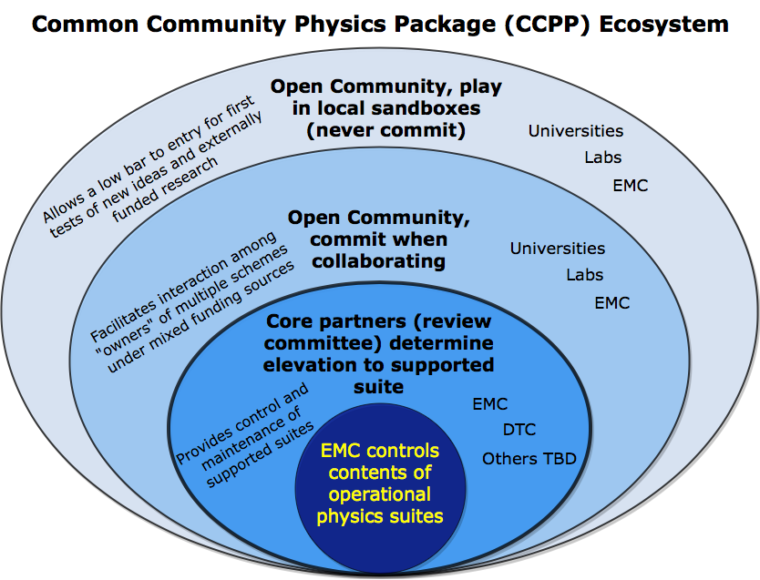

.. _Overview:

*************************
CCPP Overview
*************************

Ideas for this project originated within the Earth System Prediction Capability (ESPC)
physics interoperability group, which has representatives from the US National Center
for Atmospheric Research (NCAR), the Navy, National Oceanic and Atmospheric Administration
(NOAA) Research Laboratories, NOAA National Weather Service, and other groups. Physics
interoperability, or the ability to run a given physics :term:`suite` in various host models,
has been a goal of this multi-agency group for several years. An initial mechanism to
run the physics of NOAA’s Global Forecast System (GFS) model in other host models was
developed by the NOAA Environmental Modeling Center (EMC) and later augmented by the
NOAA Geophysical Fluid Dynamics Laboratory (GFDL). The :term:`CCPP` expanded on that work by
meeting additional requirements put forth by
`NOAA <https://dtcenter.org/gmtb/users/ccpp/developers/requirements/CCPP_REQUIREMENTS.pdf>`_,
and brought new functionalities to the physics-dynamics interface. Those include
the ability to choose the order of parameterizations, to subcycle individual 
parameterizations by running them more frequently than other parameterizations, 
and to group arbitrary sets of parameterizations allowing other computations in
between them (e.g., dynamics and coupling computations).

The architecture of the CCPP and its connection to a host model is shown in
:numref:`Figure %s <ccpp_arch_host>`.
There are two distinct parts to the CCPP: a library of physical parameterizations
(*CCPP-Physics*) that conforms to selected standards and an infrastructure (*CCPP-Framework*)
that enables connecting the physics to a host model.

.. _ccpp_arch_host:

.. figure:: _static/ccpp_arch_host.png

   *Architecture of the CCPP and its connection to a host model,
   represented here as the driver for an atmospheric model (yellow box). The dynamical
   core (dycore), physics, and other aspects of the model (such as coupling) are
   connected to the driving host through the pool of physics caps. The CCPP-Physics is
   denoted by the gray box at the bottom of the physics, and encompasses the
   parameterizations, which are accompanied by physics caps.*

The host model needs to have functional documentation for any variable that will be
passed to or received from the physics. The :term:`CCPP-Framework` is used to compare the variables
requested by each physical :term:`parameterization` against those provided by the host model [#]_, and
to check whether they are available, otherwise an error will be issued. This process serves
to expose the variables passed between physics and dynamics, and to clarify how information
is exchanged among parameterizations. During runtime, the CCPP-Framework is responsible for
communicating the necessary variables between the host model and the parameterizations.

There are multiple options to build the CCPP (see more detail in Chapter 3). For example,
with the CCPP dynamic build, all the CCPP-compliant parameterizations are compiled into a
library which is linked to the host model at runtime. Conversely, with the CCPP static
build, one or more physics suites are compiled into a library and linked to the host model
when it is compiled. The dynamic build favors flexibility as users can select the
parameterizations and their order at runtime, while the static build favors performance
as it provides superior execution time and a smaller memory footprint. The type of build
defines several differences in the creation and use of the auto-generated code, many of
which are not exposed to the user.  The differences pertain to the interfaces between
CCPP-Framework and the physics (physics *caps*) and the host model (host model *cap*), as
well as in the procedures for calling the physics. In addition, the building option varies
with choice of the host model. When the CCPP is connected to the SCM, the dynamic build
option should be used. When the CCPP is used with the :term:`UFS Atmosphere`, users have multiple
building options and should choose the one that best matches their needs.

The :term:`CCPP-Physics` contains the parameterizations and suites that are used operationally in
the UFS Atmosphere, as well as parameterizations that are under development for possible
transition to operations in the future. The CCPP aims to support the broad community
while benefiting from the community. In such a CCPP ecosystem 
(:numref:`Figure %s <ccpp_ecosystem>`), the CCPP can be used not only by the operational
centers to produce operational forecasts, but also by the research community to conduct
investigation and development. Innovations created and effectively tested by the research
community can be funneled back to the operational centers for further improvement of the
operational forecasts.

Both the CCPP-Framework and the CCPP-Physics are developed as open source code, follow
industry-standard code management practices, and are freely distributed through GitHub
(https://github.com/NCAR/ccpp-physics and https://github.com/NCAR/ccpp-framework).

.. _ccpp_ecosystem:

   *CCPP ecosystem.*

The first public release of the CCPP took place in April 2018 and included all the
parameterizations of the operational GFS v14, along with the ability to connect to the
SCM. The second public release of the CCPP took place in August 2018 and additionally
included the physics suite tested for the implementation of GFS v15. Since then, the
GFS v14 suite has been retired and additional parameterizations have been made
CCPP-compliant in order to encompass the physics suites that are under consideration
for GFS v16. The suites that are currently supported in the CCPP can be found in
:numref:`Table %s <scheme_suite_table>`. In addition to the schemes listed, more
schemes are under consideration for inclusion into the CCPP in the future. 

The CCPP is governed by the groups that contribute to its development. The governance
of the CCPP-Physics is currently led by NOAA, and the GMTB works with EMC and the Next
Generation Global Prediction System (NGGPS) Program Office to determine which schemes
and suites to be included and supported. The governance of the CCPP-Framework is jointly
undertaken by NOAA and NCAR (see more information at https://github.com/NCAR/ccpp-framework/wiki
and https://dtcenter.org/gmtb/users/ccpp). Please direct all inquiries to gmtb-help@ucar.edu. 

.. _scheme_suite_table:

.. table:: Suites supported in the CCPP

   +--------------------+-------------+-----------------+-------------+--------------+
   |                    | **GFS v15** | **GFS_v15plus** | **CPT_v0**  | **GSD_v0**   |
   +====================+=============+=================+=============+==============+
   | Microphysics       | GFDL        | GFDL            | aaMG3       | aaThompson   |
   +--------------------+-------------+-----------------+-------------+--------------+
   | PBL                | EDMF        | TKE EDMF        | EDMF        | MYNN         |
   +--------------------+-------------+-----------------+-------------+--------------+
   | Deep convection    | saSAS       | saSAS           | CSAW        | GF           |
   +--------------------+-------------+-----------------+-------------+--------------+
   | Shallow convection | saSAS       | saSAS           | saSAS       | MYNN and GF  |
   +--------------------+-------------+-----------------+-------------+--------------+
   | Radiation          | RRTMG       | RRTMG           | RRTMG       | RRTMG        |
   +--------------------+-------------+-----------------+-------------+--------------+
   | Surface layer      | GFS         | GFS             | GFS         | GFS          |
   +--------------------+-------------+-----------------+-------------+--------------+
   | Land surface       | Noah        | Noah            | Noah        | RUC          |
   +--------------------+-------------+-----------------+-------------+--------------+
   | Ozone              | NRL 2015    | NRL 2015        | NRL 2015    | NRL 2015     |
   +--------------------+-------------+-----------------+-------------+--------------+
   | H\ :sub:`2`\ O     | NRL 2015    | NRL 2015        | NRL 2015    | NRL 2015     |
   +--------------------+-------------+-----------------+-------------+--------------+

*The suites that are currently supported in the CCPP are listed in the first row. The
types of parameterization are denoted in the first column, where H2O represent the stratospheric water
vapor parameterization. The GFS_v15 suite includes the GFDL microphysics, a Eddy-Diffusivity Mass
Flux (EDMF) planetary boundary layer (PBL) scheme, scale-aware (sa) Simplified Arakawa-Schubert
(SAS) convection, Rapid Radiation Transfer Model for General Circulation Models (RRTMG) radiation,
the GFS surface layer, the Noah Land Surface Model (LSM), and the 2015 Navy Research Laboratory
(NRL) ozone and stratospheric water vapor schemes. The other three suites are candidates for
future operational implementations. The GFS_v15plus suite is the same as the GFS_v15 suite
except using the Turbulent Kinetic Energy (TKE)-based EDMF PBL scheme. The Climate Process
Team (CPT) v0 suite (CPT_v0) uses the aerosol-aware (aa) Morrison-Gettelman 3 (MG3) microphysics
scheme and Chikira-Sugiyama convection scheme with Arakawa-Wu extension (CSAW). The NOAA Global
Systems Division (GSD) v0 suite (GFS_v0) includes aaThompson microphysics,
Mellor-Yamada-Nakanishi-Niino (MYNN) PBL and shallow convection, Grell-Freitas (GF) deep
convection schemes, and the Rapid Update Cycle (RUC) LSM.*

.. [#] As of this writing, the CCPP has been validated with two host models: the Global
    Model Test Bed (GMTB) Single Column Model (SCM) and the atmospheric component of
    NOAA’s Unified Forecast System (UFS) (hereafter the UFS Atmosphere) that utilizes
    the Finite-Volume Cubed Sphere (FV3) dycore. The CCPP can be utilized both with the
    global and standalone regional configurations of the UFS Atmosphere. Work is under
    way to connect and validate the use of the CCPP-Framework with NCAR and Navy models.

.. include:: Introduction.rst
