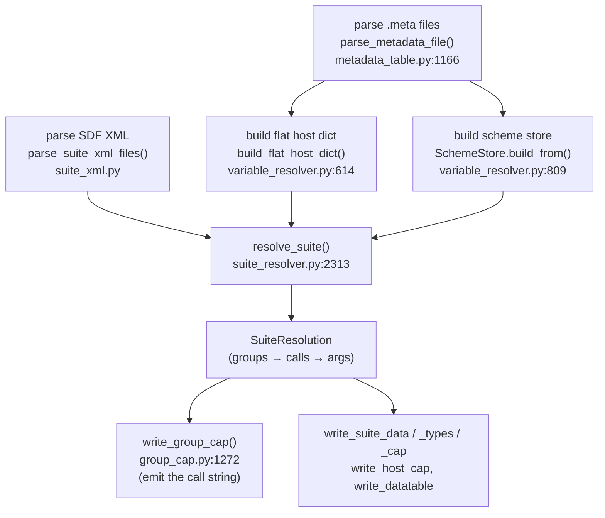
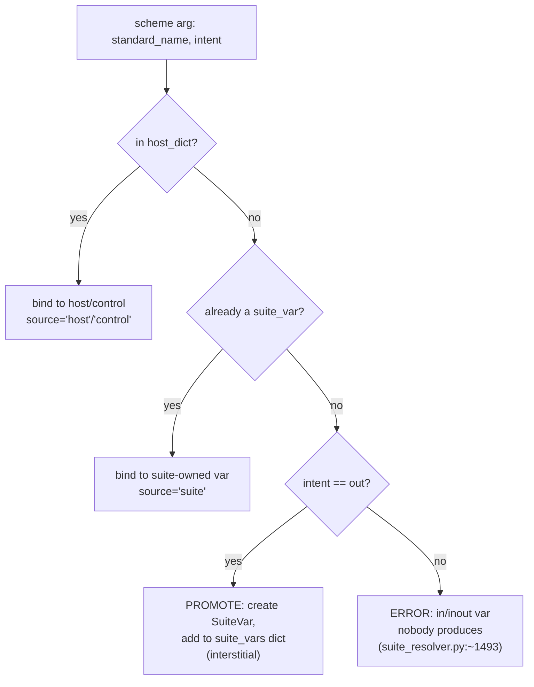
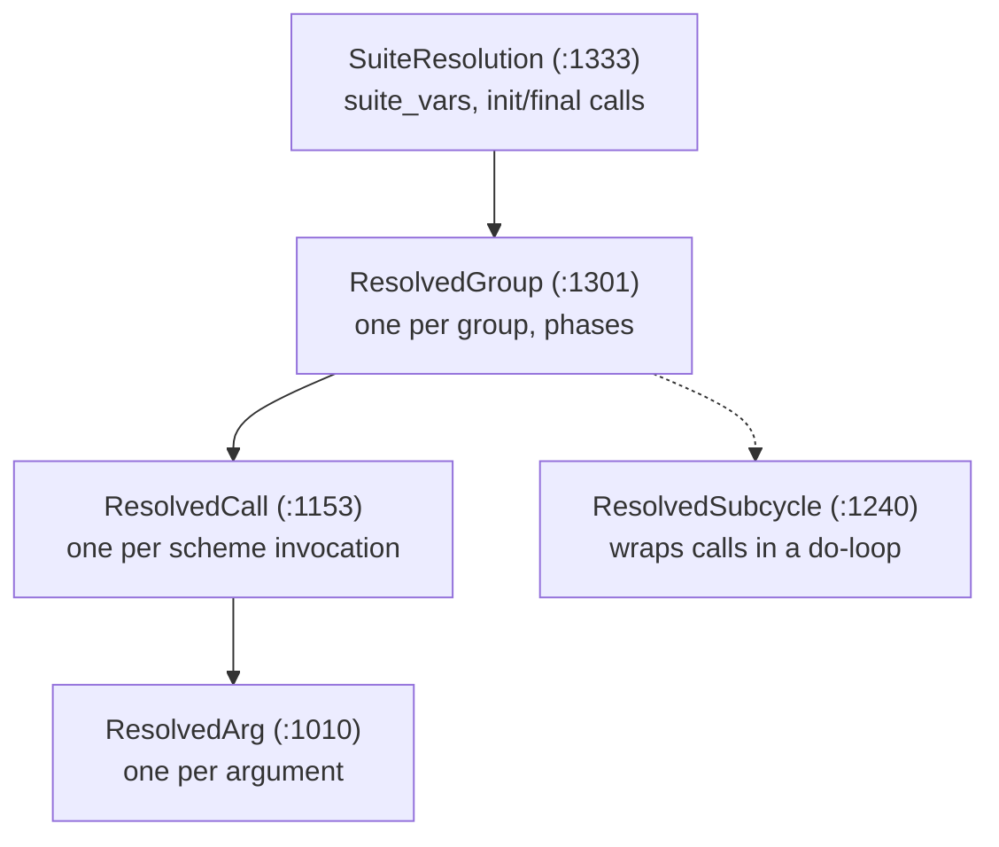
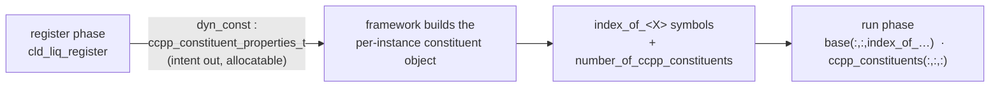

# capgen — code walkthrough for prebuild/capgen developers (DRAFT)

> **Status: temporary draft for the developer walkthrough.** All `file → routine → line`
> anchors were verified against the current tree; line numbers drift, so treat them as
> “go here,” not gospel. Three running examples: a **simple** one
> (`end-to-end-tests/instances/`) used to teach the whole pipeline, an **advanced**
> one (`end-to-end-tests/capgen/`) for the resolver’s harder features, and a
> **constituents** one (`end-to-end-tests/advection/`) for the constituent subsystem.
> Once reviewed, this folds into `doc/DevelopersGuide/`.

---

## 0. Orientation for prebuild/capgen developers

If you come from **ccpp-prebuild**: there is no Python-templated giant cap and no
`ccpp_prebuild_config.py`. capgen parses metadata and the SDF, **resolves every scheme
argument into an explicit Python object** that records *exactly* where the host data lives
and what (if any) unit/kind/flip transform it needs, then emits Fortran from those objects.

If you come from **original capgen**: the shape is familiar (metadata → host dict → suite
resolution → caps), but the data model is flatter and the resolution result is a plain
dataclass tree (`SuiteResolution → ResolvedGroup → ResolvedCall → ResolvedArg`) you can
print and inspect.

The single sentence to keep in mind:

> **A `ResolvedArg` is the unit of truth.** It stores the host-side access expression
> (`call_expr`) *and* the transform plan (`transform_case` + the forward/backward
> expressions). The emitter does almost no thinking — it just renders `ResolvedArg`s.

---

## 1. The pipeline at a glance

Everything is orchestrated by `capgen()` in **`ccpp_capgen.py:863`**.



| # | Stage | Routine (file:line) | Produces |
|---|-------|---------------------|----------|
| 1 | Parse `.meta` | `parse_metadata_file` (`metadata_table.py:1166`) → `MetadataTable` (`:940`) / `MetaVar` (`:414`) | per-file tables |
| 2 | Flat host dict | `build_flat_host_dict` (`variable_resolver.py:614`) | `{std_name: HostVarEntry}` |
| 3 | Scheme store | `SchemeStore.build_from` (`variable_resolver.py:809`) | per-scheme ordered arg lists |
| 4 | Parse SDF | `parse_suite_xml_files` (`suite_xml.py`) | suite/group/subcycle/scheme objects |
| 5 | **Resolve** | `resolve_suite` (`suite_resolver.py:2313`) | `SuiteResolution` |
| 6 | **Emit calls** | `write_group_cap` (`group_cap.py:1272`) | `ccpp_<suite>_<group>_cap.F90` |
| 7 | Emit rest | `write_suite_data/_types/_cap`, `write_host_cap`, `write_datatable` | suite data module, host cap, datatable |

---

## 2. The dictionaries — what exists *before* matching

### 2a. Per-file tables (`MetadataTable` / `MetaVar`)

`parse_metadata_file` returns one `MetadataTable` per `[ccpp-table-properties]` block; each
holds the `[ccpp-arg-table]` variables as `MetaVar`s (standard_name, local_name, type, kind,
units, dimensions, intent, optional, active, …). This is a faithful in-memory copy of the
`.meta` text — no matching yet.

### 2b. The flat host dictionary — `host_dict`

Built once by `build_flat_host_dict` (`variable_resolver.py:614`). It is a flat map keyed by
**standard name**; each value is a `HostVarEntry` (`variable_resolver.py:244`):

```
host_dict : { standard_name -> HostVarEntry }

HostVarEntry
├─ standard_name        "data_array2"
├─ local_name           "data_array2"
├─ access_path          "instance_data(instance_number)%data_array2"   ← fully-qualified!
├─ module_name          "data"            (None for control vars)
├─ type / kind          "real" / "kind_phys"
├─ units                "m2 s-2"
├─ dimensions           ["horizontal_dimension"]
├─ protected / optional / allocatable / active
└─ top_at_one           (vertical orientation, for flip detection)
```

Key point for prebuild devs: **DDT flattening happens here, at dict-build time.** A host
DDT instance (e.g. `instance_data(number_of_instances)` of type `instance_type`) is walked
recursively (`build_ddt`, `variable_resolver.py:~454`) so that each leaf becomes its own
`HostVarEntry` whose `access_path` already contains the component path and the instance
subscript — e.g. `instance_data(instance_number)%data_array2`. By the time resolution runs,
there are no DDTs left to chase; just standard-name → access-path.

### 2c. The scheme store

`SchemeStore.build_from` (`variable_resolver.py:809`) holds, per scheme + phase, the ordered
list of dummy arguments (each a `MetaVar`). This is the *demand* side: “scheme X, run phase,
wants these standard names with these intents/units/dims.”

### 2d. Snapshot — `instances/` before resolution

Host side (from `instances/data.meta`), after DDT flattening:

```
host_dict = {
  "horizontal_dimension"        -> ncols              (control/host scalar, int)
  "number_of_species"           -> nspecies
  "data_array_all_species"      -> instance_data(instance_number)%data_array        dims (horiz, species)
  "data_array"                  -> instance_data(instance_number)%data_array(:,2)   ← scalar-index sub-var
  "data_array2"                 -> instance_data(instance_number)%data_array2       units m2 s-2
  "data_array_opt"              -> instance_data(instance_number)%data_array(:,1)   optional, active=(flag_for_opt_array)
  "flag_for_opt_array"          -> instance_data(instance_number)%opt_array_flag
  "instance_number"             -> (control var)
  "number_of_instances"         -> (control var, the instance count)
}
```

Demand side (`unit_conv_scheme_1.meta`, run phase): `ccpp_error_message`,
`ccpp_error_code`, `instance_number`, `data_array` (inout, **m**), `data_array2`
(inout, **J kg-1**), `data_array_opt` (inout, **m**, optional).

Notice the two mismatches the resolver must handle: `data_array2` is **`m2 s-2`** on the host
but **`J kg-1`** in the scheme (a unit transform), and `data_array_opt` is **optional**.

---

## 3. Resolution — matching schemes against the dictionaries

`resolve_suite` (`suite_resolver.py:2313`) walks the suite in execution order
(groups → subcycles → schemes → phases). For each scheme argument it looks the standard
name up and lands in one of three cases:



- **Found in host** → `host_dict.get(std)` (`_resolve_single_bound`, `suite_resolver.py:429`).
- **Not found, first use is `intent(out)`** → it’s an interstitial; **promote** it to a
  suite-owned variable: a `SuiteVar` (`:964`) is created and added to the running `suite_vars`
  dict, so later schemes that read it bind via `source='suite'`. This is capgen’s answer
  to prebuild’s “where do interstitials live” — they’re emitted into `ccpp_<suite>_data.F90`.
- **Not found, first use is `in`/`inout`** → hard error (nobody ever writes it). See the
  “undefined intent(out)” discipline — capgen refuses to silently read an unproduced var.

The two dictionaries in play during resolution:

| Dict | Lifetime | Keyed by | Value |
|------|----------|----------|-------|
| `host_dict` | built once, read-only | standard_name | `HostVarEntry` |
| `suite_vars` | **grows during resolution** | standard_name | `SuiteVar` |

So “how are variables resolved between schemes?” → scheme A’s `intent(out)` arg that isn’t a
host variable creates a `SuiteVar`; scheme B later in the same suite, reading the same
standard name, matches that `SuiteVar`. The connection is by **standard name**, and the
storage is `ccpp_suite_data%<local_name>` (`SuiteVar.access_path`).

---

## 4. Where the resolution is stored — `ResolvedArg`

This is the crux of your question. Each matched argument becomes a **`ResolvedArg`**
(`suite_resolver.py:1010`). It carries both halves: *where the host data is* and *how to
shuttle it into/out of the scheme*.

```
ResolvedArg
├─ scheme_local_name     "data_array2"        ← keyword in the Fortran call
├─ intent / is_optional / active(_local)
├─ source                "host" | "control" | "suite" | "constituent"
├─ host_entry            -> HostVarEntry       (None if suite-owned)
├─ suite_var             -> SuiteVar           (None if host)
│
│   ── WHERE THE DATA IS ───────────────────────────────────────
├─ base_expr             "instance_data(instance_number)%data_array2"
├─ subscript             "(:)"   or  "(lb:ub, 1:nlev)"  …
├─ call_expr             base_expr + subscript            ← the access string
├─ used_dim_std_names    {standard names used in the subscript}  → drives USE + dummy args
│
│   ── HOW TO SHUTTLE IT ──────────────────────────────────────
├─ transform_case        1=direct · 2=pointer · 3=transform · 4=pointer+transform
├─ needs_unit/kind/vert  flags
├─ unit_forward          host→scheme expr (pre-call, intent in/inout)
├─ unit_backward         scheme→host expr (post-call, intent out/inout)
├─ temp_name             "<local>_l"   transform temporary
└─ ptr_name              "<local>_p"   optional pointer wrapper
```

The objects nest exactly like the suite:



`ResolvedCall.used_modules` (`:1168`) aggregates `{module: {symbols}}` across its args so the
emitter can write the `use … only:` lines. `write_suite_meta` (`suite_data.py:481`) dumps this
whole tree to a `.meta` for inspection — **the fastest way to see a resolution is to read that
file after a run.**

### `instances/` resolution snapshot

| scheme arg | std name | source | `call_expr` | transform_case |
|---|---|---|---|---|
| `instance` | `instance_number` | control | `instance_number` (dummy arg) | 1 (direct) |
| `data_array` | `data_array` | host | `instance_data(instance_number)%data_array(:,2)` | 1 (direct; m=m) |
| `data_array2` | `data_array2` | host | `instance_data(instance_number)%data_array2` | **3** (m2 s-2 ↔ J kg-1) |
| `data_array_opt` | `data_array_opt` | host | `instance_data(instance_number)%data_array(:,1)` | **2** (optional) |

(`instance_number` is a control var → `module_name = None` → passed as a dummy argument
threaded down from `ccpp_physics_run`, not `use`d.)

---

## 5. Emission — `ResolvedArg` → the call string

`write_group_cap` (`group_cap.py:1272`) renders each `ResolvedCall`:

1. **USE statements** from `used_modules` (host/suite modules + symbols).
2. **Pre-call lines** — `_pre_call_lines` (`group_cap.py:575`).
3. **The call** — `<scheme_local_name>=<actual_arg>` for every arg.
4. **Post-call lines** — `_post_call_lines` (`group_cap.py:613`).

The `transform_case` decides everything (the “actual arg” passed is in column 3):

| case | meaning | pre-call | actual arg | post-call |
|------|---------|----------|------------|-----------|
| 1 | direct | — | `call_expr` | — |
| 2 | optional ptr | `ptr%ptr => call_expr` (or `nullify` if inactive) | `ptr%ptr` | `nullify(ptr%ptr)` |
| 3 | transform | `temp = unit_forward` (in/inout) | `temp` | `call_expr = unit_backward` (out/inout) |
| 4 | ptr + transform | `temp = unit_forward; ptr%ptr => temp` | `ptr%ptr` | `nullify; call_expr = unit_backward` |

For `instances/`, the emitted group cap (schematically) is:

```fortran
use data, only: instance_data
...
! data_array2 (case 3): host m2 s-2 -> scheme J kg-1
data_array2_l = <unit_forward applied to instance_data(instance_number)%data_array2>
! data_array_opt (case 2): optional pointer
if (flag_for_opt_array) then
  data_array_opt_p%ptr => instance_data(instance_number)%data_array(:,1)
else
  nullify(data_array_opt_p%ptr)
end if

call unit_conv_scheme_1_run( &
    instance        = instance_number,                              &  ! case 1
    data_array      = instance_data(instance_number)%data_array(:,2),&  ! case 1
    data_array2     = data_array2_l,                                &  ! case 3 (temp)
    data_array_opt  = data_array_opt_p%ptr,                         &  ! case 2 (ptr)
    errmsg=errmsg, errflg=errflg)

! data_array2 post: copy back scheme -> host
instance_data(instance_number)%data_array2 = <unit_backward applied to data_array2_l>
nullify(data_array_opt_p%ptr)
```

That is the whole chain: **`.meta` → `host_dict`/scheme args → `ResolvedArg.call_expr` +
`transform_case` → these emitted lines.**

> Note the **scheme appears twice** in `instances/` (`unit_conv_scheme_1`, `_2`, `_1`).
> Each appearance is its own `ResolvedCall`; capgen dedups *init/finalize* phases by
> scheme name within a group, but **run** phases emit every appearance.

---

## 6. Running example 1 (simple) — `instances/` end-to-end

Walk it through the 7 stages:

1. **Parse** `data.meta` (host + `instance_type` DDT) and the two scheme `.meta`s.
2. **Host dict** — DDT flattened; note `data_array`/`data_array_opt` are scalar-index
   sub-views (`data_array(:,2)`, `data_array(:,1)`) of one stored array, and the instance
   subscript `(instance_number)` is baked into every `access_path` (§2d).
3. **Scheme store** — `unit_conv_scheme_1/2` run-phase arg lists.
4. **SDF** — one group, `scheme_1`, `scheme_2`, `scheme_1`.
5. **Resolve** — all args hit the host (no promotion here); one unit transform, one optional
   (§4 table).
6. **Emit** — §5 listing; plus the host driver loops `do ins = 1, ninstances` passing
   `instance = ins`, so the same cap re-runs per instance with the `(instance_number)`
   subscript selecting that instance’s slice.
7. **Rest** — `ccpp_instances_data.F90` is essentially empty (nothing promoted); the suite/
   host caps wire `instance_number`/`number_of_instances` as the paired instance control.

**What this example teaches:** the full parse→dict→resolve→emit spine, DDT flattening,
scalar-index dimensions, control vars, a unit transform (case 3), and an optional arg
(case 2) — with *zero* promotion, so the host↔scheme matching is unobscured.

---

## 7. Running example 2 (advanced) — `capgen/` : what the resolver adds

Same pipeline; this case exercises the features `instances/` doesn’t. Read it for:

- **Suite-level promotion (interstitials).** A scheme’s `intent(out)` var that no host table
  declares becomes a `SuiteVar` (§3) and is emitted into `ccpp_temp_suite_data.F90`. Trace a
  variable that is *not* in `test_host.meta` but is produced by one scheme and consumed by a
  later one — that is the `suite_vars` path, and the “variables that should be promoted to
  suite level” bullet in the case’s `README.md`.
- **Deeper DDT usage**, including an *undocumented* DDT member — exercises `build_ddt`
  recursion and the “don’t require every component to be documented” rule.
- **Non-standard / integer dimensions** and `ccpp_constant_one:N` vs bare `N` — exercises the
  subscript builder (`_build_call_subscript`, `suite_resolver.py:479`) and dimension
  canonicalisation (`_canonical_dim`, `:761`).
- **Register-phase dimensions** set by a scheme and then used to size module-level
  interstitials — the resolver must order phases so the dimension is known before allocation
  (`validate_init_dimensions`, called from `capgen()`).
- **Multiple suites & groups + threading** — one `ResolvedGroup` per group, dispatched by the
  suite cap’s `select case` on `group_name`.

Suggested walkthrough move: open `write_suite_meta`’s output for `temp_suite`, find a
promoted variable, and show its `SuiteVar` (no `host_entry`, `access_path =
ccpp_suite_data(1)%…`) next to the two `ResolvedArg`s that produce and consume it.

---

## 8. Running example 3 (constituents) — `advection/`

Constituents are the one major subsystem the first two examples don’t touch — and the entire
constituent half of `ResolvedArg` (`source='constituent'`, `is_constituent_arg`,
`constituent_module_name`, `constituent_extra_symbols`, `constituent_index_std_names`,
`used_const_dim_std_names`) only comes alive here. `advection/` (cloud liquid/ice tracers)
exercises **three distinct constituent paths**. Suite: `const_indices`, `cld_liq`,
`apply_constituent_tendencies`, `cld_ice`, `apply_constituent_tendencies`.

### The model (for prebuild developers)

A **constituent** is a tracer the *host’s dynamical core* owns — water vapor, cloud liquid,
ozone, a chemistry species — that physics reads and updates, together with an optional
**tendency** (the rate of change physics writes back for the dycore to advect it forward).
The crucial difference from an ordinary host variable: the host does **not** hand you a Fortran
array per constituent. The framework owns **one `ccpp_model_constituents_t` object per model
instance**, holding all constituent values (`%vars_layer`), tendencies (`%vars_layer_tend`),
metadata (`%const_metadata`), and the count (`%num_layer_vars`). The resolver translates
standard-name references into subscripts into that object. *(Authoritative deep-dive:
`doc/constituents.md` — “the four rules.”)*

Three questions prebuild developers always ask:

**1. What makes a variable a constituent?** Two independent triggers, plus host override:
- a scheme arg carries a **hint attribute** — any of `advected = true`, `constituent = true`,
  or a non-default `molar_mass` (`MetaVar.is_constituent`, `metadata_table.py:724`); **or**
- the arg’s **type** is `ccpp_constituent_properties_t` — the register-phase descriptor array
  (a separate flag, `is_constituent_arg`); **and**
- constituent-ness is ultimately the **host’s** decision. A scheme that only *reads* a name
  need not re-flag it — capgen infers it from the set of names *some* scheme flags (“rule
  b”). If the host declares the name as an ordinary variable, that wins
  (`design_constituent_host_wins`).

**2. Where/how are constituents registered?** Exactly one way to declare a *new* one (Rule 1):
a **register-phase** scheme returns an `intent=out, allocatable` array of
`ccpp_constituent_properties_t`, populating each entry via
`%instantiate(std_name=…, units=…, vertical_dim=…, advected=…, …)`. The framework collects
every register scheme’s array and merges them into each instance’s constituent object at
`ccpp_register_constituents`. You **cannot** create a base constituent in a physics phase —
that’s a hard error (Rule 4).

**3. Are they always tracer + tendency + index triples?** **No** — the pieces are independent:
- the **base constituent** (the tracer): registered once, stored in `%vars_layer`, read via
  `index_of_<X>`;
- an **optional tendency**: a *separate* arg whose standard name starts with `tendency_of_<X>`,
  stored in `%vars_layer_tend`, implicitly tied to the base of the same name (Rule 3) — a
  scheme emits one only if it has a tendency to give;
- the **index** `index_of_<X>`: not something you declare — the framework derives it and fills
  it at init via `%const_index(<real std name>)`; the value is identical for every instance.

So a constituent is *“one registered base + zero-or-more tendency references + a framework
index,”* not a fixed triple.

**How standard names map to storage** (this is what the resolver emits):

| Scheme arg references… | Resolves to |
|---|---|
| a base constituent (by name, via its index) | `ccpp_model_constituents_obj(inst)%vars_layer(<slice>, index_of_<X>)` |
| `tendency_of_<X>` | `…%vars_layer_tend(<slice>, index_of_<X>)` |
| `ccpp_constituents` | `…%vars_layer(:,:,:)` (whole array) |
| `ccpp_constituent_tendencies` | `…%vars_layer_tend(:,:,:)` |
| `number_of_ccpp_constituents` | `…%num_layer_vars` (scalar count) |
| `index_of_<X>` | module-level `integer :: index_of_<X>` |

Now, how each of these shows up in `advection/`:



### 8.1 Registration — the `ccpp_constituent_properties_t` argument

`cld_liq_register` (a **register**-phase entry) declares:

```
[ dyn_const ]
  standard_name = dynamic_constituents_for_cld_liq
  type        = ccpp_constituent_properties_t
  dimensions  = (:)
  intent      = out
  allocatable = true
```

The resolver flags this `is_constituent_arg = True` and — unlike every other not-in-host
`intent(out)` variable — **does not promote it to a `SuiteVar`**. It is a local temporary the
scheme allocates and fills with constituent descriptors (`suite_resolver.py:~1570`). The
framework gathers each register scheme’s `dyn_const` array to build the model’s constituent
set and the per-instance constituent object.

> Contrast with §3: a normal not-in-host `intent(out)` → `SuiteVar` (suite-owned data). A
> `ccpp_constituent_properties_t` `intent(out)` → *local temp, collected by the framework*.
> This special-case is the one exception to the promotion rule.

### 8.2 Flagging a produced constituent

In `cld_liq_run`:

```
[ cld_liq_array ]  standard_name = cloud_liquid_dry_mixing_ratio          advected   = .true.   intent=inout
[ cld_liq_tend ]   standard_name = tendency_of_cloud_liquid_dry_mixing_ratio   constituent = True   intent=out
```

`advected` / `constituent` (non-default) set `ResolvedArg.is_constituent = True`. The backing
store is the framework constituent array, reached by index (next).

### 8.3 Indexing one constituent — `index_of_<X>` (`source='constituent'`)

Schemes that touch a single constituent slice declare an access like:

```
[ q(:,:,index_of_water_vapor_specific_humidity) ]
  standard_name = water_vapor_specific_humidity
```

`q` is the constituent backing array; `index_of_water_vapor_specific_humidity` is a
per-constituent index symbol. This is the `source='constituent'` path, and the `ResolvedArg`
records:

| field | value | purpose |
|---|---|---|
| `constituent_module_name` | suite cap module | module to `use` |
| `constituent_extra_symbols` | `{index_of_water_vapor_specific_humidity}` | symbols to `use` (the index integers) |
| `constituent_index_std_names` | `{water_vapor_specific_humidity}` | the **real** standard name, kept verbatim |

Why keep the real name separately? The Fortran `index_of_*` symbol is **mangled** to fit the
63-char identifier limit (`_index_symbol_name`, `suite_resolver.py:148`), so its suffix is not
a reliable source of the standard name. At init, the framework fills each index via
`%const_index(<real std name>)`.

> **Host-wins:** if the host itself declares the `index_of_*` / framework names, the resolver
> short-circuits to ordinary host-arg resolution (the constituent path is skipped). That’s the
> `design_constituent_host_wins` rule.

### 8.4 The whole constituent axis — `number_of_ccpp_constituents`

`apply_constituent_tendencies_run` takes the full arrays:

```
[ const ]       standard_name = ccpp_constituents             dims (horizontal, vertical, number_of_ccpp_constituents)
[ const_tend ]  standard_name = ccpp_constituent_tendencies   dims (horizontal, vertical, number_of_ccpp_constituents)
```

`number_of_ccpp_constituents` is a **framework count dimension** — the host never declares it
as a scalar; its value comes from the per-instance constituent object at runtime. The resolver
files it under `ResolvedArg.used_const_dim_std_names` (note: *not* `used_dim_std_names`), so it
produces **no** `use`/dummy-arg, but it *is* surfaced by the host introspection routines. The
emitted call passes the whole axis (`:`) on that dimension.

### 8.5 The error suite

`cld_suite_error.xml` swaps in `dlc_liq` — a scheme whose `ccpp_constituent_properties_t`
setup is wrong — so the resolver’s constituent error reporting can be demonstrated live (a bad
constituent declaration is rejected, not silently mis-wired).

### Callout — combining with instances (`instances_advection/`)

`instances_advection/` is `advection/` **plus** multiple instances. The *only* delta: the
constituent buffer is dimensioned `(number_of_instances)` — a **wrapper-DDT array, one
constituent object per instance** — so per-instance `set_const_index` calls don’t collide
(the per-instance dynamic-constituent buffer). The constituent resolution itself is identical
to §8.1–8.4. Use it only when the audience needs the multi-instance constituent story.

---

## 9. How to follow along live

- **Run it:** point `capgen()` / `ccpp_capgen.py` at the example’s `.meta` + SDF and inspect
  the generated `ccpp_*_cap.F90`, `ccpp_*_data.F90`, and `datatable.xml`.
- **Read the resolution:** `write_suite_meta` (`suite_data.py:481`) emits the resolved suite as
  a `.meta` — the cleanest dump of `SuiteResolution`.
- **`--trace`:** regenerate with `--trace` (or flip `logical, parameter :: trace = .true.` in
  one cap) to get `CCPP TRACE <sub>` lines at runtime — useful for seeing the *call order* the
  resolution produced.
- **Unit tests as specs:** `unit-tests/test_suite_resolver.py`, `test_variable_resolver.py`,
  `test_group_cap.py` are small, readable assertions about exactly these structures.

---

## Appendix — `file → routine → line` quick reference

| Concept | Routine | File:line |
|---|---|---|
| Orchestrator | `capgen` | `ccpp_capgen.py:863` |
| Load metadata | `_load_metadata_files` | `ccpp_capgen.py:637` |
| Parse `.meta` | `parse_metadata_file` | `metadata/metadata_table.py:1166` |
| Parsed table / var | `MetadataTable` / `MetaVar` | `metadata/metadata_table.py:940` / `:414` |
| Host dict entry | `HostVarEntry` | `metadata/variable_resolver.py:244` |
| Build host dict | `build_flat_host_dict` | `metadata/variable_resolver.py:614` |
| DDT flatten | `build_ddt` | `metadata/variable_resolver.py:~454` |
| Scheme store | `SchemeStore.build_from` | `metadata/variable_resolver.py:809` |
| Parse SDF | `parse_suite_xml_files` | `generator/suite_xml.py` |
| **Resolve suite** | `resolve_suite` | `generator/suite_resolver.py:2313` |
| Resolve one bound | `_resolve_single_bound` | `generator/suite_resolver.py:429` |
| Build subscript | `_build_call_subscript` | `generator/suite_resolver.py:479` |
| Suite-owned var | `SuiteVar` | `generator/suite_resolver.py:964` |
| **Resolved arg** | `ResolvedArg` | `generator/suite_resolver.py:1010` |
| Resolved call/group/suite | `ResolvedCall` / `ResolvedGroup` / `SuiteResolution` | `:1153` / `:1301` / `:1333` |
| **Emit group cap** | `write_group_cap` | `generator/group_cap.py:1272` |
| Pre/post transform | `_pre_call_lines` / `_post_call_lines` | `generator/group_cap.py:575` / `:613` |
| Dump resolution | `write_suite_meta` | `generator/suite_data.py:481` |
